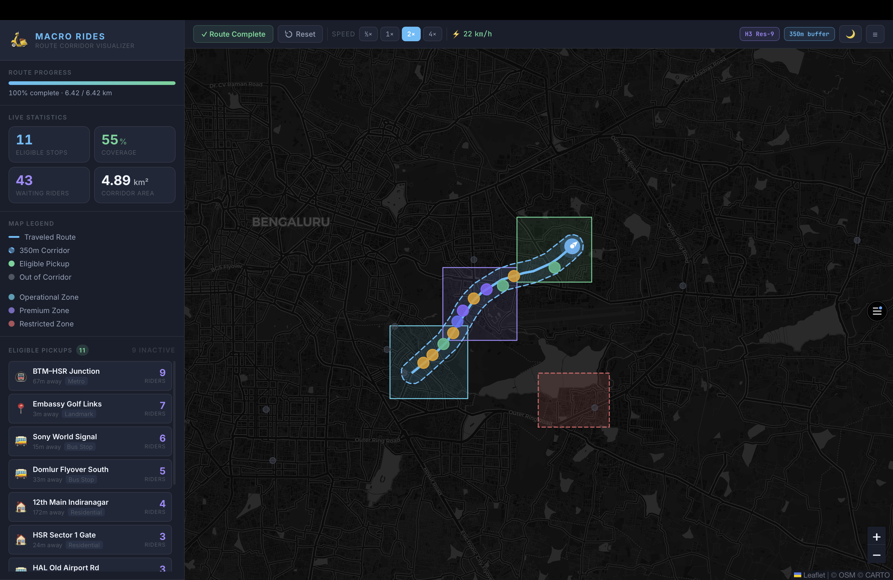

# Macro Rides — Zone Boundary & Dynamic Route Corridor Visualizer

A production-quality web application built for the Macro Rides Technical Evaluation Assignment. It visualizes a live driver route, draws a **350m buffer corridor** using Turf.js, indexes pickup points with **H3 (Resolution 9)**, and highlights eligible pickup points in real time.



---

# Live Demo

**Deployment:**
https://macro-rides-hyperlocal-ev-mobility-lilac.vercel.app/

---

# GitHub Repository

https://github.com/Vanshrao24/MACRO-RIDES-Hyperlocal-EV-Mobility

---

# Approach

The tricky part was figuring out how to check pickup eligibility in real time without doing an expensive point-to-polyline distance calculation for every pickup on every single frame, which would get heavy fast once the driver is constantly moving.

So here's what I did instead: as the driver moves along the route, Turf.js builds a 350m buffer polygon around the path travelled so far. That polygon then gets converted into H3 hexagon cells at resolution 9 (roughly 0.1 km² per cell — a decent balance between accuracy and cell count for a city-scale corridor). Every pickup point is already pre-indexed to its own H3 cell at the same resolution. So checking eligibility just becomes a simple lookup — is this pickup's cell inside the corridor's set of cells or not — instead of recalculating distance every time the route updates.

That's what keeps it cheap enough to re-run on every simulated GPS tick, which is why the corridor and the stats panel (eligible stops, coverage %, corridor area) update smoothly as the route progresses. The zone boundaries (Operational, Premium, Restricted) are drawn as separate static polygons on top, so they can later be swapped out for real geofence data without touching the corridor logic itself.

I kept the code modular too — split into separate React + TypeScript pieces for the map, H3 utilities, the route simulation hook, and the stats panel — so the same eligibility logic can later be hooked up to a live GPS feed instead of the simulation.

---

# Features

- 350m dynamic route corridor
- H3 spatial indexing (Resolution 9)
- Real-time pickup eligibility detection
- Leaflet interactive map
- Driver route animation
- Zone boundary visualization
- Live statistics panel
- Dark / Light mode
- Pickup information popup
- Modular React + TypeScript architecture

---

# How It Works

```
Driver Route
      │
      ▼
Generate 350m Buffer (Turf.js)
      │
      ▼
Convert Buffer → H3 Cells
      │
      ▼
Compare Pickup H3 Cells
      │
      ▼
Highlight Eligible Pickups
```

The application continuously updates the corridor and pickup eligibility as the simulated driver moves along the route.

---

# Tech Stack

- React 18
- TypeScript
- Vite
- Leaflet
- H3-js
- Turf.js

---

# Project Structure

```
macro-rides/
├── src/
│   ├── components/
│   ├── hooks/
│   ├── utils/
│   ├── data/
│   ├── styles/
│   ├── App.tsx
│   └── main.tsx
├── public/
├── index.html
├── package.json
├── vite.config.ts
└── README.md
```

---

# Installation

```bash
npm install
npm run dev
```

Production Build

```bash
npm run build
```

Preview

```bash
npm run preview
```

---

# Architecture

- Turf.js generates a geodesic 350m corridor around the travelled route.
- H3 converts the corridor polygon into hexagonal cells.
- Pickup locations are indexed using H3.
- Eligibility is determined using constant-time H3 cell lookups.
- Modular architecture allows easy integration with live GPS updates.

---

# Deployment

The application is deployed on **Vercel**.

Live URL:
https://macro-rides-hyperlocal-ev-mobility-lilac.vercel.app/

---

# Author

**Vansh Rao**
B.S, IIT Kanpur

GitHub:
https://github.com/Vanshrao24

Project Repository:
https://github.com/Vanshrao24/MACRO-RIDES-Hyperlocal-EV-Mobility
